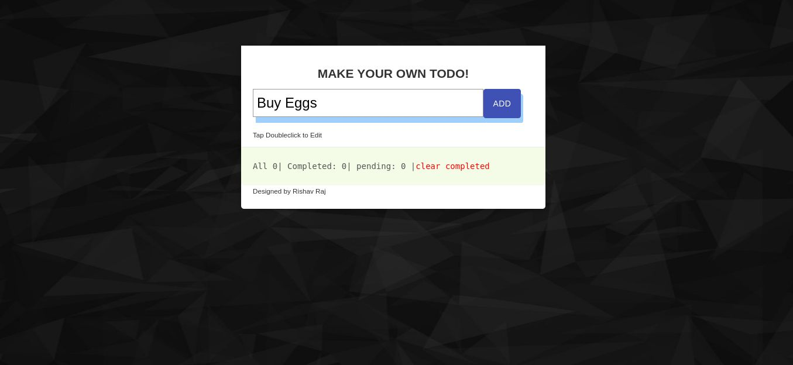
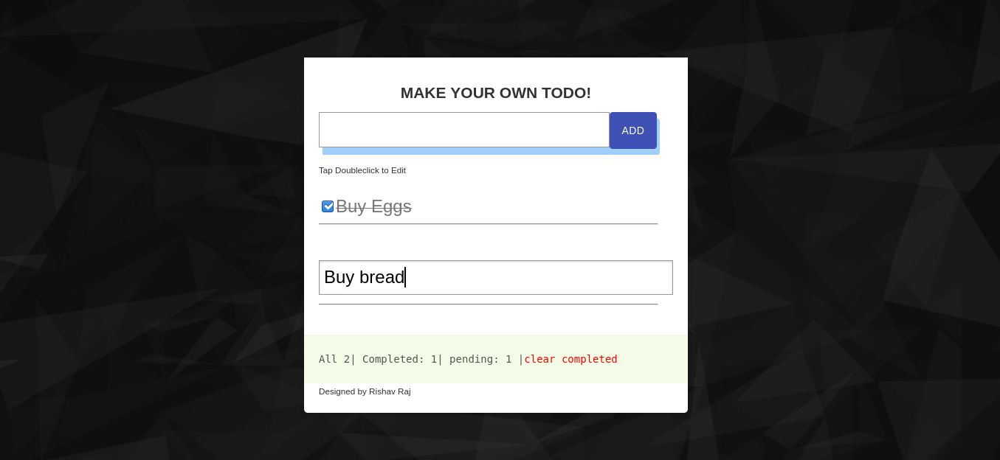
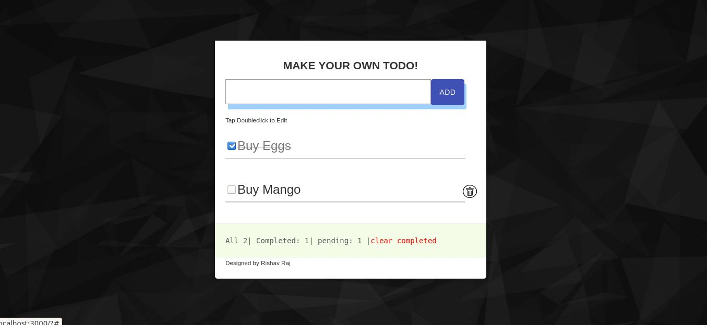

This project was bootstrapped with [Create React App](https://github.com/facebook/create-react-app).

## `ToDo App`

In the project directory, you can  list your Todo's and later edit , complete and mark them as delete also.

### `ScreenShots`
Landing page 

 
  

 Adding and Editing Items

 
  

 Check Completed Items

 

### `Installation and Setup Instructions`

Clone down this repository. You will need `node` and `npm` installed globally on your machine.

Installation:

`npm install`

To Run Test Suite:

`npm test`

To Start Server:

`npm start`

To Visit App:

`localhost:3000/`

## `Tools Used`

`React`
To learn React, check out the [React documentation](https://reactjs.org/).

`Material UI`

### `Deployement` 

deployement tool used: https://www.netlify.com/
